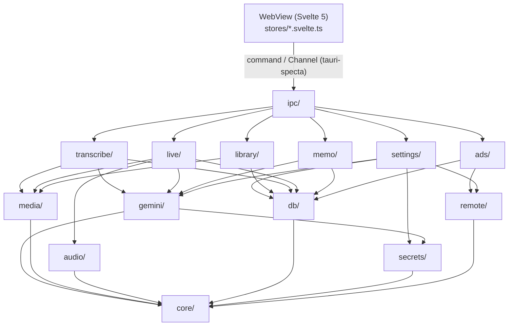
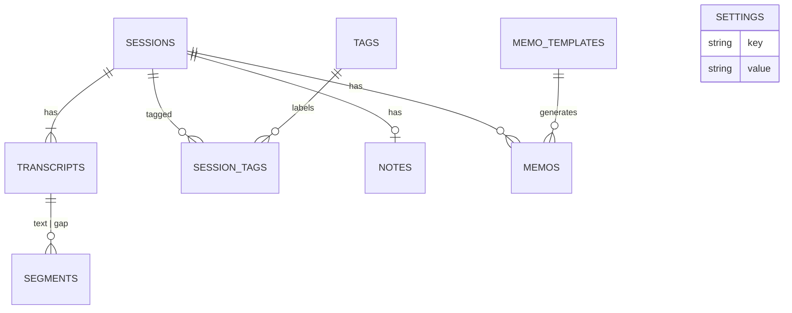
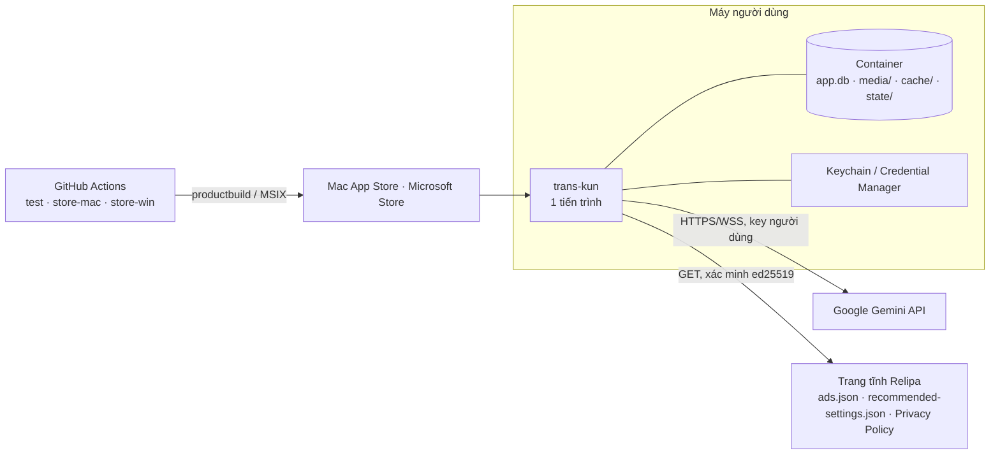

# Architecture Spine — trans-kun v3

## Design Paradigm

**Modular monolith theo tính năng, một tiến trình.** Rust sở hữu toàn bộ state (DB, Job, Phiên live, settings); WebView chỉ render và gửi lệnh. Bên trong Rust có bốn tầng, phụ thuộc chỉ đi xuống:

| Tầng | Module (`src-tauri/src/`) | Vai trò |
|---|---|---|
| Adapter UI | `ipc/` | Command/Channel tauri-specta; boot, đóng cửa sổ; nơi duy nhất điều phối chéo feature |
| Feature | `settings/` `library/` `transcribe/` `live/` `memo/` `ads/` | Một năng lực người dùng mỗi module |
| Hạ tầng | `gemini/` `media/` `audio/` `db/` `secrets/` `remote/` | Dùng chung, không biết gì về feature |
| Core | `core/` | `AppError`, ID, `Sensitive<T>`, đồng hồ, kiểu dữ liệu chung |

**Actor** (tokio task sở hữu state, giao tiếp qua message) chỉ cho ba đơn vị sống lâu có state đồng thời: `LiveSession`, `JobRegistry` (chứa `FileJob`), `KeyPool`. Mọi thứ khác là hàm thường gọi repo. **Port** (trait, có bản giả để test) chỉ ở ba biên: transport Gemini, nguồn audio, `KeyProvider`.



## Invariants & Rules

### AD-1 — Hướng phụ thuộc và ranh giới feature [ADOPTED]

- **Binds:** toàn bộ `src-tauri`
- **Prevents:** feature gọi chéo nhau thành mạng rối; mỗi epic tự dựng lối tắt sang epic khác.
- **Rule:** Phụ thuộc chỉ đi `ipc → feature → hạ tầng → core` (sơ đồ trên). Feature **không** import feature khác; dữ liệu dùng chung đi qua repo `db/`. Luồng chạm nhiều feature chỉ điều phối trong `ipc/`, gồm: `session_delete` hỏi `JobRegistry`/`LiveSession` và chặn nếu Phiên đang bận; `live_stop` → finalize → trả `session_id` để UI điều hướng; Transcribe lại lấy Recording từ repo rồi đưa vào `JobRegistry`.

### AD-2 — Actor chỉ cho LiveSession, JobRegistry, KeyPool [ADOPTED]

- **Binds:** `live/`, `transcribe/`, `gemini/keys`
- **Prevents:** mỗi epic chọn mô hình concurrency riêng cho state thay đổi đồng thời.
- **Rule:** Ba đơn vị này là tokio task sở hữu state; bên ngoài chỉ giữ handle (`mpsc` gửi lệnh, `oneshot` nhận trả lời), có truy vấn `is_busy(session_id)`. Không `Arc<Mutex<_>>` bọc state của chúng. Code khác là hàm gọi repo; thêm actor mới phải sửa spine.

### AD-3 — Đồng bộ UI bằng snapshot + delta có `seq` [ADOPTED]

- **Binds:** `ipc/`, `live/`, `transcribe/`, frontend `stores/`
- **Prevents:** mất state khi remount/reload WebView; UI báo "đang ghi"/"đang transcribe" khi worker đã chết (lỗi v2); delta rơi trong lúc restart.
- **Rule:** `live_subscribe(channel)` và `jobs_subscribe(channel)` trả `Snapshot { seq, … }` rồi đăng ký `Channel`. `seq` tăng đơn điệu **theo instance stream**: một dãy cho mỗi `LiveSession` (xuyên suốt mọi generation, generation không lộ ra UI), một dãy cho `JobRegistry` (mọi Job). UI thấy hụt `seq` → subscribe lại. Rust bỏ Channel khi `send` lỗi. UI **không bao giờ** là nguồn sự thật. `emit` toàn cục chỉ cho thông báo tần suất thấp (danh sách Phiên đổi, settings đổi).

### AD-4 — `db/` là chủ ghi duy nhất; vòng đời Phiên live là một máy trạng thái [ADOPTED]

- **Binds:** `db/`, mọi feature, FR-24, FR-30
- **Prevents:** hai epic tự mở connection và ghi song song; hai nguồn dữ liệu phục hồi; live và recovery hiểu "mồ côi" khác nhau.
- **Rule:** Một connection SQLite (WAL) do `db/` giữ, truy cập tuần tự; feature chỉ gọi hàm repo. Migration versioned, chỉ tiến, chỉ nằm trong `db/migrations`. `sessions.status ∈ {recording, finalizing, complete}`. Chỉ Phiên live đi qua `recording → finalizing`. Segment live flush định kỳ vào `segments` và đây là **nguồn duy nhất** để phục hồi. Lúc boot, Phiên còn `recording|finalizing` là mồ côi → `complete` + `recovered = true` (AD-18).

### AD-5 — Định danh và tên file [ADOPTED]

- **Binds:** `db/`, `media/`, `library/`, `remote/`, `ads/`, NFR-12, FR-11
- **Prevents:** trùng khoá giữa Phiên file/live; chuỗi người dùng hoặc server lọt vào đường dẫn.
- **Rule:** ID Phiên, Transcript, Job = UUIDv7 tự sinh. `sessions.source_hash` (SHA-256 file nguồn) là cột unique riêng để phát hiện trùng. File trong Container: `media/<session-id>/<role>.<ext>` (role: `proxy`, `recording`), `media/.staging/<job-id>/`, `cache/remote/<sha256-của-url>`. Không tên Phiên, Tag, Template, id Creative nào làm thành phần đường dẫn.

### AD-6 — Một cổng Gemini: Consent gate, lớp ưu tiên quota, không gọi nền [ADOPTED]

- **Binds:** `gemini/`, `transcribe/`, `live/`, `memo/`, `settings/`, FR-2, FR-6, NFR-8
- **Prevents:** mỗi luồng một chính sách xoay key/retry; request lọt tới Google trước Consent; Job file ăn hết quota làm Live 429 giữa họp; gọi Gemini ngầm tốn tiền người dùng.
- **Rule:** Mọi request REST/WS tới Google đi qua `gemini/` (dùng `KeyProvider` → `KeyPool`, bộ phân loại lỗi chung). Feature không dựng URL/body, không tự retry theo key. `gemini/` từ chối mọi request khi chưa có Consent phiên bản hiện hành (kể cả list models). `KeyPool` cấp key theo lớp ưu tiên `Live > Job > Memo`; khi Live nhận 429, Job ngừng gửi Chunk mới cho tới khi cooldown hết. Chỉ gọi Gemini từ thao tác người dùng hoặc Phiên/Job đang chạy, không timer. Tham số (cooldown, attempts, timeout) định nghĩa một chỗ trong `gemini::params`, giá trị theo addendum §D.

### AD-7 — Một kiểu lỗi, category ổn định [ADOPTED]

- **Binds:** `core/`, `ipc/`, frontend, NFR-6, NFR-9, FR-41
- **Prevents:** UI hiển thị chuỗi lỗi thô; mỗi epic tự đặt category; lộ key/URL.
- **Rule:** Mọi lỗi qua IPC là `AppError { category, code, detail_redacted }`. `category` là một trong 8 category UX: `quota | auth | model | network | format | permission | storage | blocked`. `code` chi tiết hơn: phân loại API (`Quota|Auth|Model|Request|Timeout|Network|Blocked|Shape`) và `Tls` (CA/proxy doanh nghiệp, thuộc `network`, có câu chữ riêng). Ánh xạ `code → category` chỉ nằm trong `core/error`. UI dịch theo `category`/`code`, không hiển thị `detail`.

### AD-8 — Settings do Rust sở hữu [ADOPTED]

- **Binds:** `settings/`, `secrets/`, `remote/`, frontend, FR-2, FR-42
- **Prevents:** hai kho settings (JS và Rust) lệch nhau; cấu hình đề xuất ghi đè im lặng; hai nguồn phiên bản Consent.
- **Rule:** Settings lưu trong bảng `settings` của SQLite, chỉ ghi qua `settings/`; **không** dùng `tauri-plugin-store`. API key chỉ ở kho khoá OS qua `secrets/`. Phiên bản Consent hiện hành là hằng số compile-time đi cùng văn bản Consent trong binary; settings lưu phiên bản người dùng đã đồng ý. Cấu hình đề xuất: `remote/` chỉ tải và xác minh; `settings/` tính diff (không bao giờ gồm key hay Consent) qua `settings_recommended_preview` và áp qua `settings_recommended_apply`.

### AD-9 — Mô hình thời gian [ADOPTED]

- **Binds:** `live/`, `transcribe/`, `db/`, export, frontend
- **Prevents:** timestamp nhảy khi reconnect/Nhận diện lại; lệch đơn vị giữa live và file.
- **Rule:** Đồng hồ Phiên live = số sample đã capture ÷ sample rate, không phải wall clock. `Segment.start/end` = giây `f64` tuyệt đối trong Phiên (Transcribe file cộng offset Chunk trước khi lưu). Mốc lưu trữ (`created_at`, `updated_at`) = epoch ms UTC. Ngoại lệ duy nhất dùng wall clock: bộ đếm "đang nối lại (m:ss)" chỉ để hiển thị. Offset (FR-13) và định dạng `HH:MM:SS` chỉ áp dụng ở UI/export.

### AD-10 — Topology Live: capture phát hai nhánh độc lập [ADOPTED]

- **Binds:** `live/`, `audio/`, `media/wav`, FR-17, FR-20, FR-22, FR-23
- **Prevents:** mất mạng hoặc restart WS làm dừng/đứt Recording; WS chậm làm nghẽn capture; UI gộp trạng thái ghi với trạng thái kết nối.
- **Rule:** Phiên live bắt đầu (tạo dòng `sessions` + file Recording) khi mở thiết bị capture thành công, kể cả lúc offline; WS nối sau theo backoff. Lỗi trước khi capture mở → dọn sạch, không để dòng hay file. Capture fan-out tới (1) WAV writer, chỉ dừng khi người dùng Dừng hoặc thiết bị lỗi, và (2) WS sender có ring buffer 60 s; không nhánh nào block capture. Audio bị đẩy khỏi buffer thành gap `disconnected` (AD-16). Restart dùng `LiveGeneration { id, … }`: event mang id cũ bị bỏ, generation cũ drain ≤ 1 s. `LiveEvent` tách `recording { state }` và `connection { connecting | reconnecting { sinceMs } | stopped }`. TTS audio đi thẳng `audio::playback`, không qua IPC; UI chỉ nhận `speaking: bool`. Đổi Nguồn audio là gate mềm trong capture.

### AD-11 — Đồng thời: Job file tuần tự, Live song song [ADOPTED]

- **Binds:** `transcribe/`, `live/`, `gemini/keys`, FR-8, FR-11, FR-12, FR-26
- **Prevents:** hai Job file tranh quota/CPU; Transcribe lại chạy ngoài hàng đợi; file trùng vẫn tốn token.
- **Rule:** `JobRegistry` giữ **một** hàng đợi tuần tự cho Transcribe file, Chạy lại và Transcribe lại. Tối đa một `LiveSession`, song song được với Job (quota theo AD-6). Sinh memo là request đơn lẻ, không vào hàng đợi. `transcribe_start` tính `source_hash` trước: trùng → trả `Existing { session_id }`, không tạo Job, không gọi Gemini. Job không sống qua restart; `JobRegistry` trong bộ nhớ là nguồn sự thật (không có bảng `jobs`). `JobEvent` có trạng thái `waitingQuota`.

### AD-12 — WebView chỉ đọc media qua asset protocol có scope [ADOPTED]

- **Binds:** Tauri config, `media/`, trình phát (FR-32)
- **Prevents:** WebView đọc file ngoài Container; mỗi màn tự mở đường đọc file.
- **Rule:** Trình phát dùng asset protocol (`app.security.assetProtocol`) với scope **chỉ** `$APPDATA/media/**`. Dữ liệu khác tới UI chỉ qua command.

### AD-13 — Frontend: store theo domain, route quyết định Ad slot, keymap tập trung [ADOPTED]

- **Binds:** `src/` (Svelte), NFR-11
- **Prevents:** component gọi IPC rải rác; mỗi màn tự đồng bộ state; Ad slot lọt vào Live; phím tắt xung đột giữa các màn.
- **Rule:** Mỗi domain có một store `src/lib/stores/<domain>.svelte.ts` (runes) bọc binding tauri-specta và thực thi AD-3; component **không** gọi `invoke`/binding trực tiếp. Hiện/ẩn Ad slot chỉ quyết định ở layout theo route (ẩn với mọi route Live). Phím tắt chỉ trong app (không global shortcut OS), đăng ký ở một module `src/lib/keymap.ts`. Token giao diện theo DESIGN.md; dark mode bắt buộc.

### AD-14 — Cấu hình từ xa đi qua `remote/` có chữ ký [ADOPTED]

- **Binds:** `remote/`, `ads/`, `settings/`, FR-42, FR-46
- **Prevents:** ads và recommended-settings mỗi bên tự fetch, cache, xác minh khác nhau.
- **Rule:** `ads.json`, ảnh Creative và `recommended-settings.json` chỉ được tải qua `remote/`: xác minh ed25519 bằng public key nhúng binary, cache theo AD-5, chữ ký sai → cache hoặc fallback nhúng sẵn. Không tải script/HTML; ảnh ≤ 100 KB. `remote/` không ghi settings (AD-8).

### AD-15 — Log content-free được ép bằng kiểu [ADOPTED]

- **Binds:** mọi module, FR-41, NFR-1
- **Prevents:** transcript/key lọt vào log qua `{:?}` hoặc chuỗi lỗi.
- **Rule:** Transcript, Bản dịch, Ghi chú, Memo, prompt và key được bọc `core::Sensitive<T>` (`Debug`/`Display` = `[redacted]`). `tracing` có layer redaction (`AIza…`, `AQ.…`, URL, `authorization`). Có test chạy Phiên mẫu rồi grep log. Xuất Nhật ký chẩn đoán qua allow-list file. Bộ đếm sử dụng/lỗi chỉ ở cục bộ; v3 không gửi thống kê đi đâu.

### AD-16 — Mô hình Phiên / Transcript / Khoảng thiếu [ADOPTED]

- **Binds:** `db/`, `transcribe/`, `live/`, `library/`, `memo/`, export, FR-11, FR-15, FR-22, FR-26, FR-34
- **Prevents:** Chạy lại tạo Phiên trùng hoặc mất Tag/Memo; file và live lưu Khoảng thiếu theo hai shape; Transcribe lại Partial đè bản live.
- **Rule:** `sessions` 1–n `transcripts (variant: primary | retranscribe, status: complete | partial)`. Tag, Ghi chú, Memo gắn **session**. Khoảng thiếu là `segments.kind = gap` với `gap_reason ∈ {chunk_failed, disconnected}`, dùng chung cho file và live. Transcript `partial` ⇔ có gap `chunk_failed`. Chạy lại (FR-11) dựng transcript mới rồi swap nguyên tử thay `primary` khi xong. Transcribe lại (FR-26) tạo `retranscribe`, không bao giờ thay bản live. Job file chỉ ghi DB khi kết thúc: làm việc trong `media/.staging/<job-id>/`, commit session + transcript + proxy trong một transaction; huỷ → xoá staging, không có dòng DB.

### AD-17 — Phong bì nền tảng và store [ADOPTED]

- **Binds:** Tauri config, `audio/`, CI, NFR-4, NFR-7, FR-17
- **Prevents:** một epic thêm plugin, subprocess hay entitlement làm trượt review store.
- **Rule:** Một tiến trình; không subprocess/sidecar, không tải/chạy code. Không dùng `tauri-plugin-{shell,fs,updater,process,http}`. macOS chỉ Core Audio process tap, **không** ScreenCaptureKit hay quyền Screen Recording. Entitlement/capability chỉ gồm: sandbox, network client, audio input, file người dùng chọn, keychain access group (macOS); `microphone` (MSIX). Thêm plugin, entitlement hay capability mới = sửa spine.

### AD-18 — Boot và đóng cửa sổ có một chủ [ADOPTED]

- **Binds:** `ipc/`, `db/`, `audio/`, `live/`, `transcribe/`, FR-12, FR-21, FR-24, FR-25
- **Prevents:** hai epic viết hai routine khởi động lệch thứ tự; chính sách đóng app mâu thuẫn khi Live và Job cùng chạy.
- **Rule:** Boot là một routine trong `ipc/`, theo thứ tự: migrate DB → phục hồi volume từ marker Ducking (`state/ducking.json`, do `audio/` sở hữu) → dọn `media/.staging` → phục hồi Phiên mồ côi (chạy nền, không chặn Home). Đóng cửa sổ do một handler trong `ipc/`: có Live → xác nhận → finalize rồi thoát; có Job → xác nhận → huỷ sạch; cả hai → finalize Live và huỷ Job.

### AD-19 — Cô lập lỗi quanh lõi [ADOPTED]

- **Binds:** `media/proxy`, `memo/`, `ads/`, `remote/`, `live/`, `transcribe/`, NFR-2
- **Prevents:** lỗi phụ làm hỏng Transcript hoặc Recording.
- **Rule:** Lỗi của proxy, memo, ads, remote không bao giờ đổi `status` của transcript hay dừng Recording. Proxy lỗi → Phiên vẫn lưu, proxy thiếu, UI đi nhánh FR-10. Finalize Live lỗi → Phiên vẫn lưu với Recording đã có.

## Consistency Conventions

| Concern | Convention |
|---|---|
| Tên command IPC | `snake_case` `<domain>_<action>` (`library_list`, `live_start`, `live_subscribe`, `settings_recommended_apply`); binding TS sinh bằng tauri-specta, không viết tay |
| Serde qua IPC | `rename_all = "camelCase"`; enum tag `{ type, … }` |
| Event trên Channel | enum `LiveEvent` / `JobEvent`, biến thể theo addendum §H + `recording`, `connection`, `gap`, `waitingQuota`; mọi event có `seq` |
| Lỗi | `Result<T, AppError>` ở mọi command (AD-7) |
| Module Rust | Mỗi feature có `mod.rs` public tối thiểu; SQL chỉ trong `db/repo/<entity>.rs` |
| Frontend | Route `/onboarding`, `/home`, `/session/:id`, `/live`, `/settings/:group`; i18n key `<màn>.<khối>.<nhãn>`, 3 ngôn ngữ cùng key set, CI chặn thiếu |
| Tham số vận hành | Hằng số một chỗ trong module sở hữu (`gemini::params`, `live::params`); PRD/addendum là nguồn giá trị |
| Version & release | Một nguồn version (`Cargo.toml` → `tauri.conf.json`), semver; migration chỉ tiến |
| Dependency | Pin trong `Cargo.lock`/`package-lock.json`; RC (tauri-specta, specta) pin exact |
| Test | Port giả cho Gemini/audio/KeyProvider; test khoá exact JSON shape request Gemini; test grep log; `cargo test` chạy trên cả macOS và Windows trong CI |

## Stack

| Name | Version |
|---|---|
| Tauri / tauri-build / @tauri-apps/cli / @tauri-apps/api | 2.11.5 / 2.6.3 / 2.11.4 / 2.11.1 |
| tauri-specta / specta | 2.0.0-rc.25 (exact) |
| tauri-plugin-dialog / tauri-plugin-opener | 2.7.3 / 2.5.5 |
| Rust edition · tokio | 2021 · 1.53.1 |
| rusqlite (bundled) · rusqlite_migration | 0.40.2 · 2.6.0 |
| keyring | 4.2.0 |
| reqwest (feature `rustls`, platform verifier) · tokio-tungstenite (`rustls-tls-native-roots`) | 0.13.5 · 0.30.0 |
| symphonia · rubato · flacenc · hound | 0.6.1 · 5.0.0 · 0.5.1 · 3.5.1 |
| cpal · wasapi · objc2 · coreaudio-sys | 0.18.2 · 0.24.0 · 0.6.4 · 0.2.18 |
| tracing · tracing-appender | 0.1.44 · 0.2.5 |
| uuid (v7) · sha2 · ed25519-dalek | 1.26.1 · 0.11.0 · 3.0.0 |
| Svelte · Vite · @sveltejs/vite-plugin-svelte · TypeScript | 5.57.0 · 8.3.0 · 7.3.0 · 6.0.3 |
| marked · dompurify · vitest | 18.0.13 · 3.4.15 · 5.0.1 |
| Nền tảng | macOS ≥ 14.4 universal; Windows 10 1809+/11 x64 (+ Arm64), WebView2 Evergreen |

## Structural Seed

```text
trans-kun/
  src/                      # Svelte 5 SPA
    lib/stores/  lib/keymap.ts
    lib/bindings.ts         # sinh bởi tauri-specta, không sửa tay
    routes/  components/  i18n/{vi,en,ja}.json
  src-tauri/
    src/
      ipc/{boot,close,…}  core/
      settings/  library/{sessions,tags,notes,export}  transcribe/  live/  memo/  ads/
      gemini/{keys,params,rest,interactions,live}  media/{decode,resample,probe,chunk,proxy,wav}
      audio/{capture,coreaudio_tap,wasapi,playback,output_volume}   # port từ v2 audio/ (cpal 0.16 → 0.18)
      db/{migrations,repo}  secrets/  remote/
    tauri.conf.json  tauri.appstore.conf.json  tauri.msix.conf.json
  .github/workflows/        # test (mac + win), store-mac, store-win
```





Môi trường: `dev` (ký bằng cert team `B2U85XPU55` vì TCC khoá theo Team ID), beta (TestFlight for Mac, Store package flight), `store`. Không có server lưu dữ liệu họp. Private key ký cấu hình từ xa nằm ngoài repo app. `[ASSUMPTION: nơi giữ private key]`

## Capability → Architecture Map

| Capability / Area | Lives in | Governed by |
|---|---|---|
| Onboarding, Consent, key (FR-1–5) | `settings/`, `secrets/`, `gemini/` | AD-6, AD-8 |
| Key pool, model (FR-6–7) | `gemini/keys`, `gemini/rest` | AD-6, AD-7 |
| Transcribe file (FR-8–16) | `transcribe/`, `media/`, `gemini/` | AD-2, AD-5, AD-9, AD-11, AD-16 |
| Live, dịch, TTS, reconnect (FR-17–22) | `live/`, `audio/`, `gemini/live` | AD-2, AD-3, AD-9, AD-10, AD-17 |
| Recording, mồ côi, thoát, Transcribe lại (FR-23–26) | `live/`, `media/wav`, `db/`, `ipc/` | AD-4, AD-10, AD-16, AD-18 |
| Home, Tag, rename/xoá, tải Recording (FR-27–31) | `library/`, `db/`, `ipc/` | AD-1, AD-4, AD-5 |
| Transcript detail, player, export (FR-32–35) | `library/`, frontend | AD-9, AD-12, AD-16 |
| Ghi chú, Memo, Template (FR-36–38) | `library/notes`, `memo/` | AD-6, AD-15, AD-19 |
| Settings, lưu trữ, chẩn đoán, cấu hình đề xuất (FR-39–43) | `settings/`, `remote/` | AD-8, AD-14, AD-15 |
| Ad slot (FR-44–46) | `ads/`, `remote/`, layout frontend | AD-13, AD-14, AD-19 |
| i18n (FR-47) · theme sáng/tối (FR-48) | `src/i18n` · token DESIGN.md | Conventions · AD-13 |
| NFR-1 riêng tư · NFR-2 không chặn lõi · NFR-3 bền phiên | xuyên suốt | AD-6, AD-15 · AD-19 · AD-4, AD-10, AD-18 |
| NFR-4 không phụ thuộc ngoài · NFR-7 sandbox | Tauri config, CI | AD-17 |
| NFR-5 hiệu năng · NFR-10 kích thước | `media/`, `db/`, frontend | Deferred (đo ở Phase 0/2) |
| NFR-6 mạng doanh nghiệp · NFR-9 hiểu lỗi | `gemini/`, `core/error` | AD-7 |
| NFR-8 chi phí | `gemini/` | AD-6, AD-11 |
| NFR-11 tiếp cận · NFR-12 đường dẫn | frontend · xuyên suốt | AD-13 · AD-5 |

## Deferred

- **Proxy FLAC vs AAC native / player trong Rust** — chờ spike S8; `media/proxy` là điểm đổi duy nhất.
- **Opus trong webm/mkv** — chờ spike S1; mọi đường Opus hiện kéo theo libopus (C), phải cân với AD-17.
- **Model `*-transcribe`: inline hay Files API** — chờ spike S2; nằm gọn trong `gemini/interactions`.
- **tauri-specta rc.25 với Tauri 2.11 và `Channel<T>` typed** — spike Phase 0; nếu gãy, bọc Channel bằng type viết tay, AD-3 giữ nguyên.
- **Core Audio process tap qua objc2/coreaudio-sys; keyring 4 trong MAS sandbox (entitlement `keychain-access-groups`)** — spike S4/S5.
- **Ngưỡng NFR-5/NFR-10** — đo ở Phase 0/2; không đổi ranh giới module.
- **Thư viện i18n** (`i18next` hay tự viết) và **router frontend** — một frontend, bị ràng buộc bởi Conventions; chốt ở story nền tảng.
- **Nơi host trang tĩnh** — PRD Câu hỏi mở 6; `remote/` chỉ cần URL + public key.
- **Kiểm tra WebView2 Evergreen lúc chạy** — thuộc story store-win; không ảnh hưởng ranh giới.
- **Premium, `KeyProvider` thứ hai, backend ephemeral token** — Q11, addendum §K.
- **Arm64 trong bản submit đầu** — PRD Câu hỏi mở 7.
